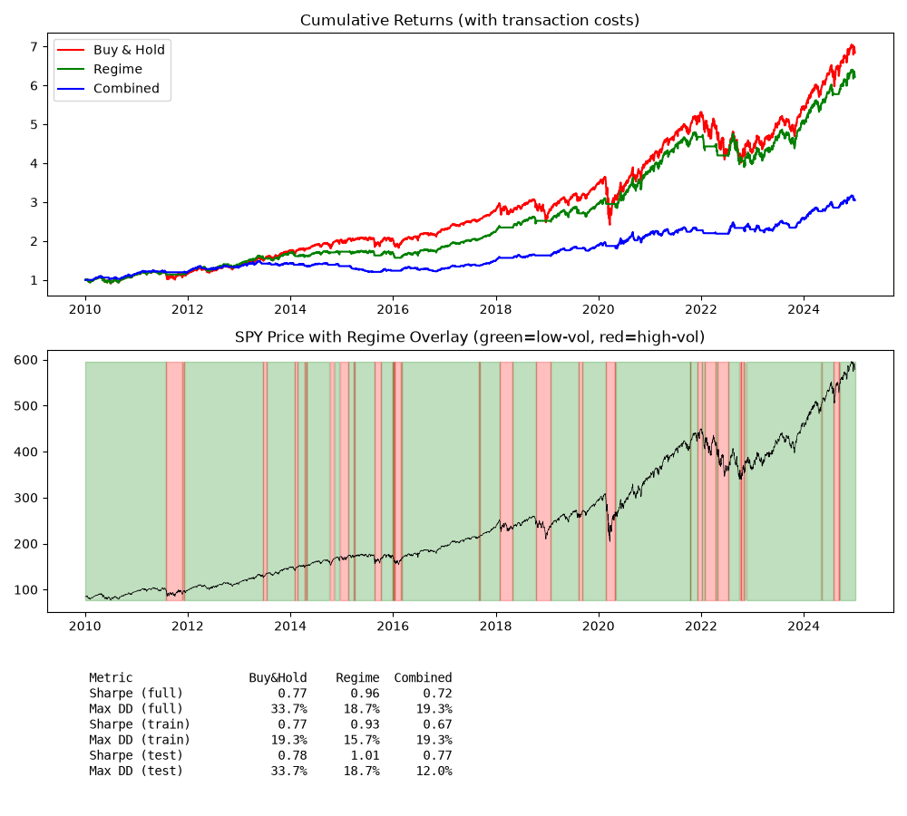
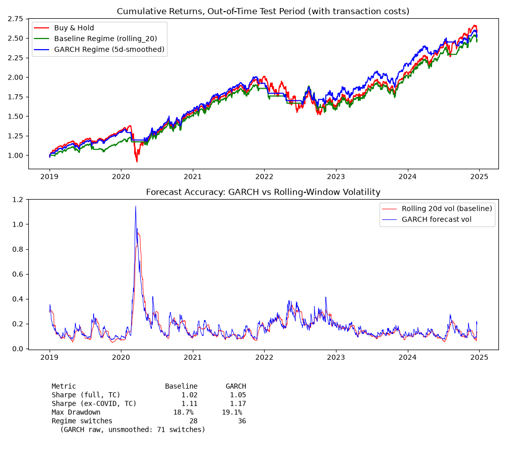

# regime-momentum-signal
Volatility regime detection, momentum, and GARCH volatility forecasting — a systematic signal study on SPY

## Motivation

Build a systematic signal that adapts to volatility regimes, as a way to develop hands-on research and backtesting
skills beyond theoretical risk modeling. The project has three connected parts: establishing the statistical basis for
a volatility-regime rule, backtesting that rule (with and without a momentum overlay), and testing whether *forecasting*
next-period volatility with a GARCH model produces a better-timed signal than reacting to trailing volatility.

## Data

SPY + VIX + 3-month T-bill (^IRX), daily, 2010-2024, via yfinance. Using Close 
prices (not dividend-adjusted) — a simplification to revisit if returns need to 
reflect total return.

**Setup:** run `data_download.py` first to fetch the data locally into `data/` 
before running `parameter_robustness_exploration.py` or `backtest.py`. Data files are not tracked in this 
repository and are regenerated by this script.

## Usage
1. `python data_download.py` — fetch SPY, VIX, IRX data into `data/`
2. `python backtest.py` — run the regime + momentum strategy, backtest with 
   transaction costs, out-of-sample split, and generate the performance tearsheet
3. `python exploratory_analysis.py` — (optional) initial exploratory analysis: returns, 
   rolling volatility, volatility clustering investigation (AR(1) fit, residual ACF, ARCH-LM test)
4. `python parameter_robustness_exploration.py` — (optional) reproduces the 
   threshold/window sensitivity analysis referenced in Methodology
5. `python volatility_forecasting.py` — fits a GARCH(1,1)-t model, evaluates its one-day-ahead volatility
   forecast against the trailing-window baseline, and backtests a forecast-based regime signal (see "Forecasting the
   volatility signal" below)

## Methodology

**Volatility clustering (statistical basis):** the regime approach assumes volatility is persistent enough to be
predictable, even though returns are largely not. Fitting an AR(1) to daily SPY returns gives a lag-1 coefficient of
−0.100 (std err 0.016, z = −6.19) — highly significant given n=3,772, but explaining roughly 1% of return variance, so
economically marginal rather than exploitable. A handful of residual autocorrelations remain marginally significant at
longer lags, but all are small in magnitude, and both AIC and BIC favour AR(1) over higher-order specifications
(AR(1) AIC −23,523 vs AR(5) −23,505). Squared residuals behave very differently: autocorrelation of roughly 0.38 at
lag 1, peaking at 0.50 at lag 2, and still around 0.13 at lag 20 — every lag well outside the confidence band — with
Engle's ARCH-LM test rejecting the null of no ARCH effect (p < 1e-260). Returns carry little exploitable structure in
level; volatility carries a great deal. See `figures/acf_returns_residuals.png` and
`figures/acf_squared_residuals.png`; reproduced by `exploratory_analysis.py`.

**Regime detection:** short-term volatility (20-day rolling) compared against long-term volatility. Two long-window
specifications were evaluated: 60-day (one quarter) and 252-day (one trading year). The 252-day specification was
selected as it produced more persistent regimes and more stable switch counts across threshold values — the 20d/60d
specification showed a sharp sensitivity to threshold choice (186 switches at 1.1 vs 45 at 1.4), while the 20d/252d
specification was more robust (106 at 1.1 vs 47 at 1.4).

**Parameter robustness:** thresholds from 1.1 to 1.4 were tested on both window pairs. The 20d/252d specification produced
stable switch counts across 1.2-1.4 (55-61 switches over 14 years, approximately 4 per year), suggesting results are not
sensitive to the exact threshold in this range. A threshold of 1.2 was selected. Regime persistence of approximately 3
months on average is consistent with the momentum holding periods documented in Jegadeesh & Titman (1993).

**Forecasting the volatility signal:** the regime rule above reacts to *trailing* 20-day volatility — it only registers a
regime shift after volatility has already moved. A natural extension is to ask whether *forecasting* next-period volatility,
rather than measuring it in arrears, produces a better-timed signal. A GARCH(1,1) model with Student-t errors was fitted
for this purpose. The t-distribution is decisively preferred over Normal errors (AIC 9,378 vs 9,584; ν≈5.6, confirming the
fat tails already established statistically above), and its persistence parameters (α≈0.17, β≈0.82, α+β≈0.99) quantify the
same volatility clustering the ARCH-LM test detected. The model was fitted on 2010-2018 only and used to forecast
one-day-ahead conditional variance across a held-out 2019-2024 test period, with parameters never exposed to test data.
See `volatility_forecasting.py`.

## Signals

**Regime signal:** `regime = +1` when `rolling_20 < rolling_252 * 1.2` (low vol), 
`0` otherwise (high vol). Approximately 4 regime switches per year over 2010-2024.

**Position:** long SPY when regime = +1 (low vol), cash when regime = 0 (high vol). 
Signal lagged by one day to avoid lookahead bias.

**Momentum signal:** 20-day cumulative return (`spy["returns"].rolling(20).sum()`). 
Positive = recent winner, negative = recent loser.

**Combined position:** long SPY only when regime = +1 (low vol) AND momentum > 0 
(recent winner). Otherwise cash. Signal lagged by one day to avoid lookahead bias.

**Forecast-based regime signal:** the same regime rule, but with the trailing 20-day volatility 
replaced by the GARCH one-day-ahead volatility forecast (5-day trailing-smoothed — see Results for 
why smoothing is necessary). `regime = +1` when `garch_forecast_vol_smoothed < rolling_252 * 1.2`. 
The forecast smoothing uses a trailing window only, introducing no lookahead.

## Backtest

**Period:** 2010-2024, daily rebalancing.  
**Benchmark:** SPY buy-and-hold.  
**Risk-free rate:** 3-month US T-bill (^IRX), converted to daily decimal.

| Metric | Buy & Hold | Regime Strategy | Combined Strategy |
|---|---|---|---|
| Cumulative return (no TC) | 6.84x | 6.61x | 4.01x |
| Cumulative return (with TC) | 6.84x | 6.22x | 3.05x |
| Sharpe ratio (no TC) | 0.77 | 0.99 | 0.91 |
| Sharpe ratio (with TC, 0.1%/switch) | 0.77 | 0.96 | 0.72 |
| Max drawdown (no TC) | 33.7% | 17.8% | 14.3% |
| Max drawdown (with TC) | 33.7% | 18.7% | 19.3% |
| Regime switches | — | 61 | 275 |

**Out-of-sample split (with TC):**

| Metric | Period | Buy & Hold | Regime Strategy | Combined Strategy |
|---|---|---|---|---|
| Sharpe ratio | Train (2010-2018) | 0.77 | 0.93 | 0.67 |
| Sharpe ratio | Test (2019-2024) | 0.78 | 1.01 | 0.77 |
| Max drawdown | Train (2010-2018) | 19.3% | 15.7% | 19.3% |
| Max drawdown | Test (2019-2024) | 33.7% | 18.7% | 12.0% |

**Forecast-based regime vs trailing-volatility baseline (out-of-sample test period, 2019-2024, with TC):**
 
| Metric | Trailing-vol regime | GARCH-forecast regime (smoothed) |
|---|---|---|
| Sharpe ratio (full test period) | 1.02 | 1.06 |
| Sharpe ratio (excluding COVID) | 1.11 | 1.17 |
| Max drawdown | 18.7% | 19.1% |
| Regime switches (full) | 28 | 36 |

## Results

**Summary: the regime signal alone is robust and adds value; the momentum 
combination, as currently specified, does not.**

See the Performance Tearsheet above for the equity curves, the regime overlay on price, and the full train/test metrics
breakdown.

The regime strategy achieves nearly identical cumulative return to buy-and-hold 
(6.61x vs 6.84x — giving up only ~3% of total return) while improving the Sharpe 
ratio (0.99 vs 0.77) and nearly halving maximum drawdown (17.8% vs 33.7%). The 
strategy underperforms during the sustained low-volatility bull market post-2018, 
but the volatility filter's drawdown protection during stress periods largely 
compensates. 

Adding a 20-day momentum filter (invest only when regime = low vol AND 20-day 
return > 0) significantly reduces cumulative return (4.0x vs 6.6x for regime-only) 
despite marginally improving max drawdown (14.3% vs 17.8%). The 20-day momentum 
signal is too noisy as a binary filter — it generates frequent unnecessary exits 
within calm regimes, missing upside in a generally trending market. A longer 
momentum window or continuous position sizing rather than binary filtering would 
be more appropriate — left for future work.

Accounting for transaction costs (0.1% per position change) confirms the regime 
strategy's benefit is largely robust — cumulative return drops modestly from 
6.61x to 6.22x (Sharpe 0.99 to 0.96) given its 61 switches over 14 years. The 
combined regime+momentum strategy fares much worse: switching 275 times — 
4.5x more often, since both the regime and momentum signals must independently 
align — means transaction costs erode cumulative return from 4.01x to 3.05x 
(Sharpe 0.91 to 0.72), now clearly below buy-and-hold on both metrics. This is 
an important finding: a signal that looks marginally useful gross of costs 
can become value-destructive once realistic trading costs are included, 
reinforcing why the naive momentum combination is not adopted as currently 
specified.

An out-of-sample check (train 2010-2018, test 2019-2024) confirms the regime 
strategy's robustness: it improves Sharpe over buy-and-hold in both periods 
(0.77→0.93 train, 0.78→1.01 test) and reduces max drawdown in both (19.3%→15.7% 
train, 33.7%→18.7% test). The combined strategy is less consistent — it 
underperforms buy-and-hold on Sharpe in the train period (0.67 vs 0.77) but 
roughly matches it in test (0.77 vs 0.78), while offering better drawdown 
protection in both periods. This period-dependence, combined with the 
transaction cost sensitivity already noted, suggests the regime signal alone 
is the more robust and reliable component of this research.

**Can forecasting the volatility signal do better?** Out-of-sample (parameters fitted 
pre-2019), the GARCH forecast beats the trailing 20-day estimate at predicting next-day 
realized variance across three target definitions (single-day squared return, forward 
5-day realized variance, and calm-period-only) and two loss functions (RMSE and QLIKE) — 
six comparisons, GARCH lower error in all six. The forecast leads rather than lags at 
regime shifts: at the February 2020 onset, for example, the GARCH forecast registered 
elevated volatility a day ahead of the trailing window, which by construction can only 
react after the fact.

Whether that forecasting advantage translates into a better *strategy* is a separate
question. Substituting the raw GARCH forecast for trailing volatility in the regime rule
initially produced far more switching (71 vs 28 over the test period) — the forecast is
more responsive to genuine regime shifts but also to daily noise, the same failure mode
that undermines the momentum filter. Applying a 5-day trailing smoother to the forecast
before thresholding cuts this to 34-36 switches. The smoothed forecast-based regime then
modestly outperforms the trailing-volatility baseline on risk-adjusted return over the
out-of-sample period (Sharpe 1.06 vs 1.02 with transaction costs; 1.17 vs 1.11 excluding
the COVID crisis), at the cost of slightly more switching and marginally higher drawdown.
The forecast's accuracy edge does carry through to the strategy — the improvement is small
but robust, and notably wider outside the 2020 crisis rather than driven by it, indicating
it is not a crisis artifact. This mirrors the momentum finding from the other direction: a
more *responsive* signal is not automatically a better one, and controlling its reactivity
(here via smoothing) is what allows its underlying quality to show through net of costs.

See the GARCH Tearsheet above for the out-of-sample equity curves, the forecast-vs-baseline overlay, and the full
metrics comparison.

## Limitations
- Momentum combination is not currently viable: naive 20-day binary filter is 
  too noisy, degrades performance after transaction costs, and shows 
  inconsistent results across train/test periods — not adopted as currently specified
- Regime filter reduces absolute returns vs buy-and-hold, particularly post-2018 
  in sustained low-vol bull markets — a real cost of the drawdown protection
- The GARCH-forecast regime's improvement over the simple trailing-volatility rule is 
  modest (Sharpe ~+0.04 with costs) and comes with marginally higher drawdown; whether 
  it justifies the added model complexity is a genuine judgment call, not a clear win
- Momentum crashes: any future momentum-based signal remains vulnerable to sharp 
  market reversals (e.g. COVID 2020) where recent winners become losers rapidly
- Regime changes: when the macro environment shifts fundamentally (rate cycle 
  reversal, recession onset), past volatility patterns may stop being predictive
- Volatility clustering is established statistically, but that only confirms 
  persistence exists — it does not establish that a 20d/252d ratio rule is the 
  best way to exploit it
- Crowding: if too many participants run similar strategies, the edge erodes
- Horizon sensitivity: momentum (if used) only works at 3-12 month horizons
- Using raw Close, not dividend-adjusted — understates true returns
- Past performance doesn't guarantee future regimes/results

